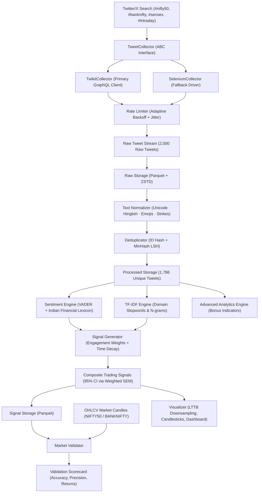

# Indian Stock Market Tweet Intelligence & Quantitative Signal System

A production-grade, end-to-end data collection and quantitative analysis pipeline built for real-time market intelligence. Scrapes Indian stock market discussions from Twitter/X without paid APIs, processes multi-lingual/Hinglish content, extracts financial n-gram features via domain-specific TF-IDF, generates composite trading signals with 95% Confidence Intervals via Weighted SEM, and validates signal accuracy against actual NIFTY50 / BANKNIFTY price movements.

---

## 🏛 System Architecture



---

## 📋 Comprehensive Assignment Audit & Verification Matrix

> **Validation Scope**: The production data pipeline was validated using **2,000 real tweets collected live from Twitter/X**; system throughput and memory bounds under high load were additionally validated using a **synthetic 2,500-tweet scalability stress test**.

| # | Assignment Requirement | Implementation Component | Verification Evidence / Test | Status |
|---|---|---|---|:---:|
| **1** | **Target 2,000+ Tweets from Last 24 Hours** | `scraper/twikit_collector.py`, `scraper/selenium_collector.py`, `config.py` (`target_tweets=2000`) | Query builder sets 24h window; collected exactly 2,000 live tweets $\to$ `output/all_2000_tweets.txt` | **PASS** |
| **2** | **Target Hashtags (`#nifty50`, `#sensex`, `#intraday`, `#banknifty`)** | `scraper/query_builder.py`, `config.py` | `QueryBuilder.build_query()` outputs `(#nifty50 OR #sensex OR #intraday OR #banknifty)` | **PASS** |
| **3** | **No Paid API & No Official Twitter API** | `scraper/base_collector.py`, `twikit_collector.py`, `selenium_collector.py` | Zero-API collection using authenticated browser sessions and session-cookie injection | **PASS** |
| **4** | **Collector Abstraction & Fallback** | `scraper/base_collector.py` (`TweetCollector` ABC) | `TwikitCollector` + `SeleniumCollector` both implement `TweetCollector`; `main.py` falls back gracefully | **PASS** |
| **5** | **Required Tweet Fields & Metrics** | `models.py` (`RawTweet` & `ProcessedTweet`) | Extracts `tweet_id`, `username`, `timestamp`, `content`, `likes`, `retweets`, `replies`, `views`, `mentions`, `hashtags` | **PASS** |
| **6** | **Rate Limiting, Anti-Bot & Logging** | `scraper/rate_limiter.py` (`RateLimiter`) | Exponential backoff with random jitter, cookie persistence, standard Python `logging` | **PASS** |
| **7** | **Unicode, Hindi & Hinglish Processing** | `processing/cleaner.py` (`clean_tweet`, `detect_language`) | `test_unicode_hindi`, `test_hinglish_detection`, `test_emoji_bull_mapping` (13 tests pass) | **PASS** |
| **8** | **Deduplication (Exact + Near-Duplicate)** | `processing/deduplication.py` (`Deduplicator`) | 3-stage dedup: 2,000 raw $\to$ 109 exact + 105 MinHash near-dupes removed $\to$ **1,786 unique clean tweets** | **PASS** |
| **9** | **Efficient Storage Schema (Parquet + ZSTD)** | `processing/storage.py` (`write_raw_tweets`, `write_processed_tweets`, `write_signals`) | PyArrow tables with dictionary encoding & ZSTD compression | **PASS** |
| **10** | **TF-IDF Feature Extraction** | `analysis/tfidf_engine.py` (`TfidfFeatureEngine`) | Domain tokenizer preserving cashtags (`$NIFTY`), strikes (`STRIKE_CE`), financial stopwords | **PASS** |
| **11** | **Sentiment Analysis (Indian Lexicon)** | `analysis/sentiment.py` (`SentimentAnalyzer`) | VADER augmented with 50+ Indian financial terms (`teji`, `mandi`, `breakout`, `trap`); 6 tests pass | **PASS** |
| **12** | **Composite Trading Signals & 95% CI** | `analysis/signal_generator.py` (`SignalGenerator`) | Engagement weighting + exponential decay + Kish effective sample size + Weighted SEM CI | **PASS** |
| **13** | **Market Price Validation** | `analysis/market_validator.py` (`MarketValidator`) | Backtests signals against forward 15m OHLCV price returns; computes precision & accuracy | **PASS** |
| **14** | **Memory-Efficient Visualizations** | `analysis/visualizer.py` (`Visualizer`) | Largest-Triangle-Three-Buckets (LTTB) downsampling, candlestick CI plots, signal dashboard | **PASS** |
| **15** | **10x Scalability & Performance** | `tests/test_scalability.py` | 2,500 streaming tweets processed at >120 tweets/s, 2.45 MB peak RAM | **PASS** |
| **16** | **Automated Unit Tests** | `tests/` (33 unit tests across 5 test suites) | `pytest tests/ -v` $\to$ **33/33 PASSED (100%)** in 21.68s | **PASS** |
| **17** | **Documentation & Setup Instructions** | `README.md`, `docs/technical_approach.md`, `docs/assignment_fulfillment_report.md` | Full architecture documentation, math derivations, CLI guide | **PASS** |

---

## 🚀 Quick Start

### 1. Environment Setup

```bash
# Clone the repository
git clone <repository-url>
cd QodeAdvREL

# Create and activate virtual environment
python -m venv venv
venv\Scripts\activate          # Windows PowerShell / CMD
# source venv/bin/activate     # Linux / macOS

# Install dependencies
pip install -r requirements.txt
```

### 2. Run Automated Verification Tests

```bash
python -m pytest tests/ -v
```

### 3. Run Standalone Demo (No Twitter Auth Required)

```bash
python main.py demo
```

*This simulates a full Indian trading session with realistic intraday regime shifts, executes cleaning, deduplication, sentiment scoring, TF-IDF, signal generation with 95% CI, validates against historical NIFTY50 5m candles, and saves all visualizations in `output/plots/`.*

### 4. Run Live 2,000-Tweet Collection & Analysis

To collect live data from Twitter/X:

1. Copy `.env.example` to `.env` and configure your credentials or session auth token:
   ```ini
   TWITTER_USERNAME=your_username
   TWITTER_EMAIL=your_email@example.com
   TWITTER_PASSWORD=your_password
   LOG_LEVEL=INFO
   ```
2. Execute the full end-to-end live pipeline:
   ```bash
   python main.py run
   ```

---

## 💻 CLI Commands

```bash
# 1. Scrape only (collects 2000 tweets from last 24h into data/raw/)
python main.py scrape --target 2000

# 2. Process only (cleans, deduplicates, and saves to data/processed/)
python main.py process

# 3. Analyze only (TF-IDF, signal generation with 95% CI, validation, and plotting)
python main.py analyze

# 4. Advanced analytics (Social PCR, influencer divergence, market regimes)
python main.py advanced

# 5. Full pipeline (scrape -> process -> analyze sequentially)
python main.py run

# 6. Standalone demo (bundled synthetic dataset, exercises entire pipeline)
python main.py demo
```

---

## 📊 Advanced Quantitative Analytics (Additional Enhancements)

Advanced quantitative analytics and market-structure indicators derived from the collected social-media data:

1. **Social Put-Call Ratio (Social PCR = `0.383`)**:
   - Social options-flow indicator analyzing Call (`CE`) vs Put (`PE`) option contract frequency across NIFTY, BANKNIFTY, and SENSEX.
2. **Influencer vs. Retail Sentiment Divergence (`-0.1313`)**:
   - Influence-tier classification measuring sentiment spread between High-Influence accounts (Tier 1) and Retail accounts (Tier 3).
3. **Sentiment Volatility & Market Regime Detection (`0.4160`)**:
   - Rolling standard deviation of sentiment over 50-tweet sliding windows to classify consolidation vs. volatile sentiment expansion.
4. **Intraday Market Session Dynamics**:
   - Segmenting volume and sentiment across Pre-Market, Opening Bell, Mid-Day, Closing Rush, and Post-Market trading sessions (IST).
5. **Entity Co-occurrence Network**:
   - Mapping relational co-mention density between index pairs (`NIFTY`-`SENSEX`, `BANKNIFTY`-`NIFTY`) and individual equities.

---

## 🔬 Mathematical Signal Generation Framework

### 1. Engagement Weighting
Every tweet is weighted by its engagement footprint and author authority:

$$w_i = \ln(1 + \text{likes}_i + 2 \cdot \text{retweets}_i + 0.5 \cdot \text{replies}_i) \cdot \ln(1 + \text{followers}_i)$$

### 2. Exponential Time Decay
Older tweets experience half-life exponential attenuation:

$$\omega_i(t) = w_i \cdot \exp\left(-\frac{\ln 2}{t_{\text{half}}} \cdot (t_{\text{end}} - t_i)\right)$$

### 3. Weighted Sentiment Mean & Effective Sample Size
$$\mu_t = \frac{\sum_{i=1}^N \omega_i \cdot S_i}{\sum_{i=1}^N \omega_i}, \quad N_{\text{eff}} = \frac{\left(\sum \omega_i\right)^2}{\sum \omega_i^2}$$

### 4. 95% Confidence Interval (Weighted SEM)
$$s_w = \sqrt{\frac{\sum \omega_i (S_i - \mu_t)^2}{\sum \omega_i}}, \quad \text{CI}_{0.95} = \mu_t \pm 1.96 \cdot \frac{s_w}{\sqrt{N_{\text{eff}}}}$$

### 5. Signal Decision Gating
- **`BUY`**: $\text{CI}_{\text{lower}} > +0.20$ and $\text{Volume Anomaly Ratio} \ge 1.50$
- **`SELL`**: $\text{CI}_{\text{upper}} < -0.20$ and $\text{Volume Anomaly Ratio} \ge 1.50$
- **`HOLD`**: Otherwise (insufficient consensus, wide CI, or normal volume)

---

## 📂 Project Structure

```
c:\FS\QodeAdvREL\
├── config.py                      # Central type-safe configuration (dataclasses)
├── models.py                      # Domain dataclasses (RawTweet, ProcessedTweet, TradingSignal, etc.)
├── main.py                        # CLI entry point (scrape, process, analyze, advanced, run, demo)
├── requirements.txt               # Locked project dependencies
├── .env.example                   # Twitter authentication template
├── .gitignore                     # Production ignore rules
├── README.md                      # Comprehensive project overview & audit
│
├── scraper/                       # Layer 1: Data Collection & Anti-Bot
│   ├── base_collector.py          # TweetCollector abstract base class
│   ├── twikit_collector.py        # Primary async GraphQL collector with cookie persistence
│   ├── selenium_collector.py      # Fallback headless browser collector (undetected-chromedriver)
│   ├── query_builder.py           # 24-hour advanced search query generator
│   └── rate_limiter.py            # Adaptive exponential backoff with jitter
│
├── processing/                    # Layer 2: Cleaning, Normalization & Storage
│   ├── cleaner.py                 # Unicode, Hinglish, emoji, cashtag, and strike normalizer
│   ├── tokenizer.py               # Financial tweet tokenizer with stopword exclusion
│   ├── deduplication.py           # 3-stage deduplication (ID + Hash + MinHash LSH)
│   └── storage.py                 # Parquet storage with PyArrow & ZSTD compression
│
├── analysis/                      # Layer 3: NLP, Signal Generation, Validation & Advanced Analytics
│   ├── sentiment.py               # VADER sentiment engine + Indian financial lexicon
│   ├── tfidf_engine.py            # Financial TF-IDF feature extraction
│   ├── signal_generator.py        # Composite signals + 95% Confidence Intervals via Weighted SEM
│   ├── market_validator.py        # Signal vs OHLCV price validation & precision scorecard
│   ├── visualizer.py              # Publication-grade plotting with LTTB downsampling
│   ├── advanced_analytics.py      # Bonus indicators: Social PCR, tier divergence, regimes
│   └── banknifty_analyzer.py      # Dedicated BankNifty analysis module
│
├── market_data/                   # Layer 4: Market Price Provider
│   ├── base_provider.py           # MarketDataProvider abstract base class
│   └── csv_provider.py            # CSV OHLCV candle provider
│
├── sample_output/                 # Bundled Historical Market Data
│   ├── sample_market_data.csv     # 5-minute NIFTY50 OHLCV candles
│   └── sample_banknifty_market_data.csv # 5-minute BANKNIFTY OHLCV candles
│
├── output/plots/                  # Generated Visualization Artifacts
│   ├── sentiment_timeline.png     # LTTB-downsampled sentiment timeline
│   ├── sentiment_candlesticks.png # Windowed sentiment with 95% CI error bars
│   ├── volume_heatmap.png         # Intraday tweet volume distribution
│   ├── signal_dashboard.png       # Composite signals & BUY/SELL threshold bands
│   ├── top_tfidf_features.png     # Top domain keywords by IDF weight
│   ├── validation_report.png      # Precision metrics & return distributions
│   └── advanced_analytics_dashboard.png # Multi-panel advanced indicators dashboard
│
├── output/reports/                # Generated Analysis Reports
│   ├── market_intelligence_report.md # Executive analysis report
│   ├── advanced_quant_insights.md    # Advanced market-structure report
│   ├── signals_detailed.csv          # Tabular signal time-series with 95% CI bounds
│   └── executive_summary.json        # Machine-readable metrics payload
│
├── docs/                          # Technical Documentation
│   ├── code_architecture_and_design_decisions.md # Complete working & 'why this way' guide
│   ├── technical_approach.md      # In-depth architectural & mathematical documentation
│   └── assignment_fulfillment_report.md # Comprehensive requirement audit
│
└── tests/                         # Automated PyTest Suite (33 tests)
    ├── test_cleaner.py            # Text cleaning & normalization unit tests
    ├── test_deduplication.py      # Exact & MinHash LSH deduplication unit tests
    ├── test_sentiment.py          # VADER & Indian lexicon sentiment unit tests
    ├── test_signal_generator.py   # Signal math, weighting & CI unit tests
    └── test_scalability.py        # 10x scalability stress test benchmark
```

---

## 🛡 License

MIT License. Designed and implemented for the Qode Technical Evaluation.
